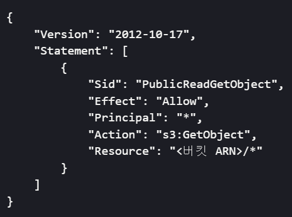
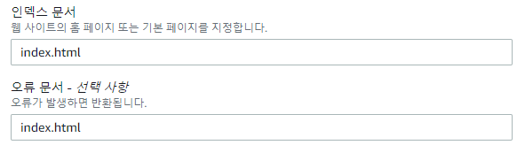
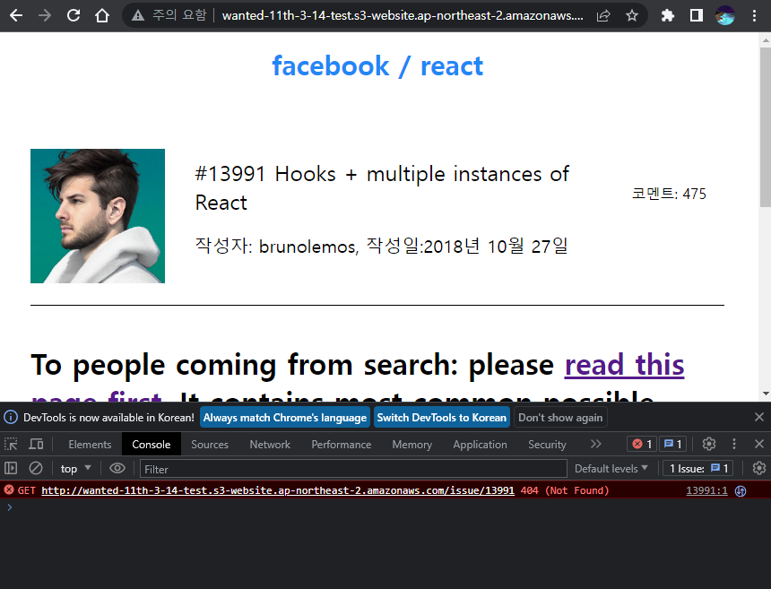
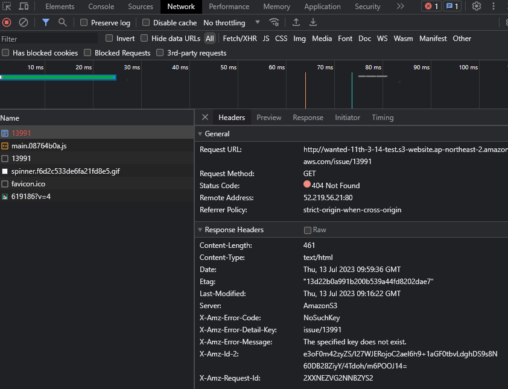

# 3차 회의록

 2023.07.13 

## 💥 수정 사항 적용

### ⏺️ API 클래스화

1. 기본적인 `BaseUrl` 설정
   - `create`: 클래스가 생성되는 부분 인 `constructor`에서 함수 실행(`index.tsx`에서 초기화)

 

2. Github Issues Api Get 부분 작성
   - `getIssueList`: Issue 목록 가져오는 부분
   - `getIssueItem`: Issue 상세페이지 가져오는 부분

 

3. hook에 적용
   - `useFetchIssueList`, `useFetchIssueItem`에 useContext 적용

 

### ⏺️ 무한 스크롤시 Loading 화면 수정

1. 문제점: 처음 리스트 가져올 때는 Loading 컴포넌트가 보였지만 스크롤 시 보이지가 않습니다.
   - css 스타일 부분에서 `position: sticky`와 `bottom: 0`로 변경하여 해결

 

### ⏺️ type 수정

- 일부 `any` type으로 지정된 타입들을 명확한 type으로 수정하였습니다. [7e3a9b7](https://github.com/wanted-pre-onboarding-11th-14team/pre-onboarding-11th-3-14/commit/7e3a9b7faa25dfe2755c5ae475a7dc75c6e08c85)

 

## 💥 배포

### ⏺️ AWS S3를 사용한 배포 적용

> AWS S3의 정적 웹사이트 호스팅 사용
>
> 참고 자료: https://docs.aws.amazon.com/ko_kr/AmazonS3/latest/userguide/WebsiteHosting.html

- 설정

  | 버킷 정책                | 문서 설정              |
  | ------------------------ | ---------------------- |
  |  |  |

- 문제점 (미해결)
  - 전체적으로 작동에 문제는 없으나 상세페이지에서 알 수 없는 404에러가 발생
    |Console|Network|
    |---|---|
    |||
